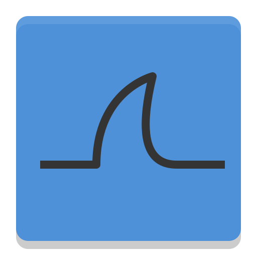

<h1>🧑🏿‍🦱Abdimalik yuusuf </h1>

🔐 I'm a security analyst and pentester passionate about securing systems and helping organizations safeguard their most crucial assets. With a background in web development spanning 2 years, I transitioned into the captivating realm of cybersecurity and have been deeply enamored ever since ❤️.

<h2>🎓Certifications</h2>

CompTIA Security+ (SY0-701)

Google Cybersecurity Professional Certificate

ISC2 Certified in Cybersecurity (CC) 

<h2>📂 Projects </h2>

🛡️ Penetration Testing Lab – Built and documented simulated attacks and defenses in a virtual environment.

🔍 Log Analysis with SIEM (Wazuh + Splunk) – Detected and responded to malicious activities through log monitoring.

🖥️ Active Directory Security Lab – Hardened and tested Windows domain environments.

⚡ EDR Project (LimaCharlie) – Monitored and detected malicious tools on endpoints. 

<h2>🌟Programming languages</h2>

<h2>🔧Tools</h2>

<h2>🚀Frameworks</h2>

<h2>Database</h2>

<h2> 🌐 Additional Info </h2>
Founder of FashilHack – A cybersecurity initiative focused on simulating attacks & securing businesses.
Interested in defensive & offensive security, with a career roadmap from Security Analyst ➝ Penetration Tester ➝ Red Teamer.

